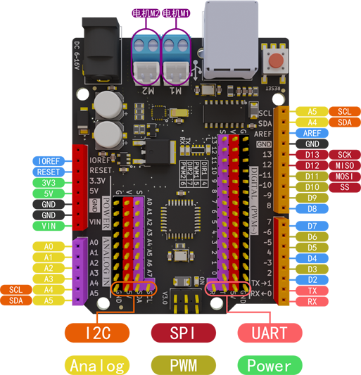

# Maker-Uno Operation Specification
[中文版](README_ZH.md) English

- [Maker-Uno Operation Specification](#maker-uno-operation-specification)
  - [Purchase Link](#purchase-link)
  - [Product Brief Introduction](#product-brief-introduction)
  - [Product Parameter](#product-parameter)
  - [Pin Specification](#pin-specification)
  - [Motor Function Description](#motor-function-description)
  - [Indicator Description](#indicator-description)
  - [CH340G Driver Installation](#ch340g-driver-installation)
  - [FAQ:](#faq)
  - [Contact us](#contact-us)

## [Purchase Link](https://item.taobao.com/item.htm?spm=a1z10.5-c-s.w4002-21556097795.26.23ae6b0dJkBCqZ&id=680974076367)


## Product Brief Introduction

​	Maker-Uno is a representative product for creator based on Arduino Uno R3,Features and pins are fully compatible with traditional Arduino Uno motherboards,Maximum driving current 2A of onboard 2-way motor drive chip,All I/O ports are drawn with Pin Header,The serial port chip is CH340G。

## Product Parameter
|function|Arduino Uno|Maker-Uno|
| :-: | :-: | :-: |
| microcontroller | ATmega328 | ATmega328 |
| Serial chip | Atmega16u2 | Ch340G |
| input voltage | 7-12 V | 7-16V |
| working voltage (current output) | 5V(500mA) | 5V(1000mA) |
| 3.3V maximum current output | 150mA | 500mA |
| basic frequency | External crystal oscillator 16M | External crystal oscillator 16M |
| input voltage | 7-12 V | 7-16V |
| Flash | 32K(Bootloader occupy 0.5k) | 32K(Bootloader occupy 0.5k) |
| SRAM | 2K | 2K |
| ERROM | 1K | 1K |
| Motor drive chip | none | TC78H660FTG |
| IO interface |  Female Header | Pin Header+Female Header |
| size/weight | 68.6 x 53.4 mm / 25g | 68.6 x 53.4 mm / 25g |
| bootloader download mode | SPI | SPI |
## Pin Specification 




#### **[Product Schematic Diagram](./picture/Maker_Uno.pdf)**

## Motor Function Description

​		Motor drive chip is TC78H660FTG，The maximum driving current is 2A.Only 2 PWM channels and 2 ordinary io channels are needed to drive 2-way motor,Reduce the occupation of PWM port,Can not drive high-power motor，Only conventional TT motor and building block motor can be driven.


DIR1：Control the direction of M1 motor		DIR2：Control the direction of M2 motor		PWM1：Control the speed of M1 motor		PWM2：Control the speed of M2 motor
|DIR1(D4)|PWM1(D5)|DIR2(D7)|PWM2(D6)| OUT1+ | OUT1- | OUT2+ | OUT2- | Mode |
| :-: | :-: | :-: | :-: | :-: | :-: | :-: | :-: | :----: |
| H | H | — | — | H | L | — | — | `M1 foreward` |
| L | H | — | — | L | H | — | — | `M1 reversal` |
| — | — | H | H | — | — | H | L | `M2 foreward` |
| — | — | L | H | — | — | L | H | `M2 reversal` |
| — | L | — | L | L | L | L | L | `M1,M2 stop` |

**注：** L :low level 		H：high level		—：none		


**Arduino Motor Test Case**

```
#define DIR1 4  // define direction 4 port
#define PWM1 5  // define pwm1 5 port
#define DIR2 7  // define direction 7 port
#define PWM2 6  // define pwm2 6 port

void setup() {
  Serial.begin(9600);
  pinMode(DIR1, OUTPUT);
  pinMode(PWM1, OUTPUT);
  pinMode(DIR2, OUTPUT);
  pinMode(PWM2, OUTPUT);
}

void loop() {
  // forward speed 255
  Serial.println("M1,M2 Forward");
  digitalWrite(DIR1, HIGH);
  digitalWrite(PWM1, 255);
  digitalWrite(DIR2, HIGH);
  digitalWrite(PWM2, 255);
  delay(2000);
  // reversal speed 255
  Serial.println("M1,M2 Reversal");
  digitalWrite(DIR1, LOW);
  digitalWrite(PWM1, 255);
  digitalWrite(DIR2, LOW);
  digitalWrite(PWM2, 255);
  delay(2000);
  // Stop speed 255
  Serial.println("M1,M2 Stop");
  digitalWrite(DIR1, LOW);
  digitalWrite(PWM1, LOW);
  digitalWrite(DIR2, LOW);
  digitalWrite(PWM2, LOW);
  delay(2000);
}
```

[Click to download the motor test program](https://github.com/emakefun/maker-uno/releases/download/v1.0.0/DC_MotorTest.zip)

## Indicator Description

- ON symbol : The red indicator indicates the power indicator which will be steady on after the power supply.
- L symbol  :The yellow indicator indicates the BootLoader indicator,When connected to the computer via USB, the LED light will blink quickly when the port recognizes the board.
- RX symbol :The LED indicator is the serial port receiving indicator，When the serial port receives data, the LED light will blink.
- TX symbol :The LED indicator is the serial port sending indicator，When the serial port sends data, the LED light will blink.

## CH340G Driver Installation
[CH340G Driver download link](https://www.wch.cn/downloads/CH341SER_ZIP.html)

## FAQ:

1. Which motors can the board drive？

Reply：Support Drive TT plastic motor and building block motor, do not support to drive high-power motor。	

2. Why is the motor not moving？

Reply：If the motor cannot be driven by USB power supply, external power supply is needed.

3. Power supply mode?

Reply：3.5mm DC head power supply.

4. How to confirm whether bootloader is lost?

Reply：After pressing the reset button,if the 'L' indicator blinks for three consecutive times, the bootloader is not lost,if the 'L' indicator is not blinking,the bootloader is lost that which
need to be downloaded.

## Contact us

**Technology + cooperation：TEL:  null-lab(Wechat number)**